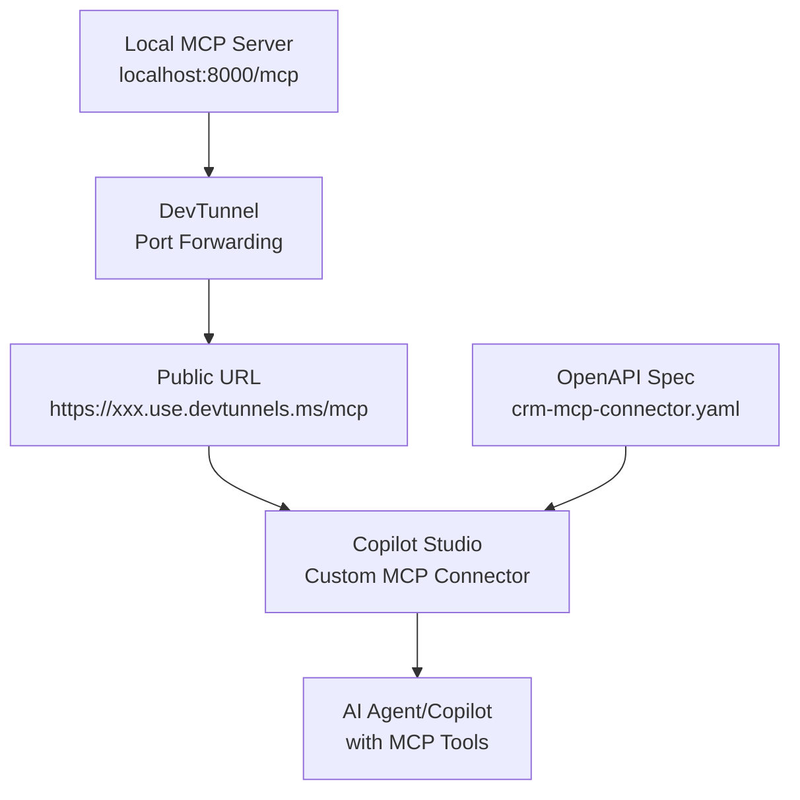

# Exposing MCP Server via DevTunnel and Connecting to Copilot Studio

This guide walks you through exposing your local MCP (Model Context Protocol) server using Microsoft DevTunnel and connecting it to Microsoft Copilot Studio using a custom MCP connector.

## 📋 Prerequisites

Before starting, ensure you have:
- ✅ Python 3.11+ installed
- ✅ DevTunnel CLI installed (`devtunnel`)
- ✅ Access to Microsoft Copilot Studio
- ✅ Azure subscription (for Copilot Studio)
- ✅ The OpenAI Workshop repository cloned locally

## 🏗️ Architecture Overview



## 🚀 Step 1: Start Your Local MCP Server

### 1.1 Set Up Python Environment

```bash
# Navigate to the backend services directory
cd OpenAIWorkshop/agentic_ai/backend_services

# Create and activate virtual environment (if not already done)
python -m venv ../../../venv
source ../../../venv/Scripts/activate  # Windows
# source ../../../venv/bin/activate    # Linux/Mac

# Install required dependencies
pip install fastmcp httpx rich pygments pydantic uvicorn cryptography authlib python-jose
```

### 1.2 Start the MCP Service

```bash
# From the backend_services directory
python mcp_service.py
```

You should see output similar to:
```
[09/01/25 09:00:01] INFO     Starting MCP server 'Contoso Customer API as Tools' with transport 'streamable-http' on http://0.0.0.0:8000/mcp
INFO:     Started server process [12345]
INFO:     Waiting for application startup.
INFO:     Application startup complete.
INFO:     Uvicorn running on http://0.0.0.0:8000 (Press CTRL+C to quit)
```

### 1.3 Verify Local MCP Server

Test your local server:
```bash
# Test the MCP endpoint
curl -X GET http://localhost:8000/mcp
```

## 🌐 Step 2: Expose MCP Server via DevTunnel

### 2.1 Create DevTunnel

```bash
# Create a new tunnel for your MCP server
devtunnel create crm-mcp --allow-anonymous

# Add port forwarding for port 8000
devtunnel port create crm-mcp -p 8000
```

### 2.2 Start DevTunnel Host

```bash
# Start the tunnel host to expose your local server
devtunnel host crm-mcp
```

You'll see output like:
```
Hosting port: 8000
Connect via browser: https://p8er9sxt.use.devtunnels.ms:8000, https://p8er9sxt-8000.use.devtunnels.ms
Inspect network activity: https://p8er9sxt-8000-inspect.use.devtunnels.ms

Ready to accept connections for tunnel: crm-mcp.use
```

### 2.3 Test Public Access

```bash
# Test your public MCP endpoint
curl -X GET https://p8er9sxt-8000.use.devtunnels.ms/mcp
```

**📝 Note**: Replace `p8er9sxt-8000.use.devtunnels.ms` with your actual tunnel URL.

## 📄 Step 3: Prepare OpenAPI Specification

The `crm-mcp-connector.yaml` file contains the OpenAPI specification for your MCP server:

### 3.1 Update the Host URL

**⚠️ Important**: Update the `host` field in `crm-mcp-connector.yaml` with your actual DevTunnel URL:

```yaml
host: YOUR_ACTUAL_TUNNEL_URL.use.devtunnels.ms
```

## 🤖 Step 4: Connect to Microsoft Copilot Studio

### 4.1 Access Copilot Studio

1. Navigate to [Microsoft Copilot Studio](https://copilotstudio.microsoft.com/)
2. Sign in with your Azure/Microsoft 365 account
3. Create a new copilot or select an existing one

### 4.2 Add Custom MCP Connector

1. **In your Agent, Go to Tools**:
   - Select **"Add a tool, new tool"**

2. **Choose Connector Type**:
   - Select **"Custom connector and new custom connector"**
   - Choose **"Import from an OpenAPI file"**

3. **Upload OpenAPI Specification**:
   - Rename the `crm-mcp-connector.template` file to `crm-mcp-connector` and edit the host details
   - Upload the `crm-mcp-connector.yaml` file
   - Refresh and connect the newly added mcp tool in copilot studio

```

If you've followed all steps correctly, you should now have:

✅ Local MCP server running and accessible  
✅ Public DevTunnel exposing your MCP server  
✅ Custom connector configured in Copilot Studio  
✅ Working MCP actions in your copilot  

Your copilot can now access customer data, billing information, and knowledge base through the MCP protocol!

## Support

If you encounter issues:

1. Check the MCP server logs for errors
2. Verify DevTunnel connectivity
3. Test the OpenAPI specification in Swagger Editor
4. Monitor network traffic via DevTunnel inspection URL
5. Review Copilot Studio connector test results

---
