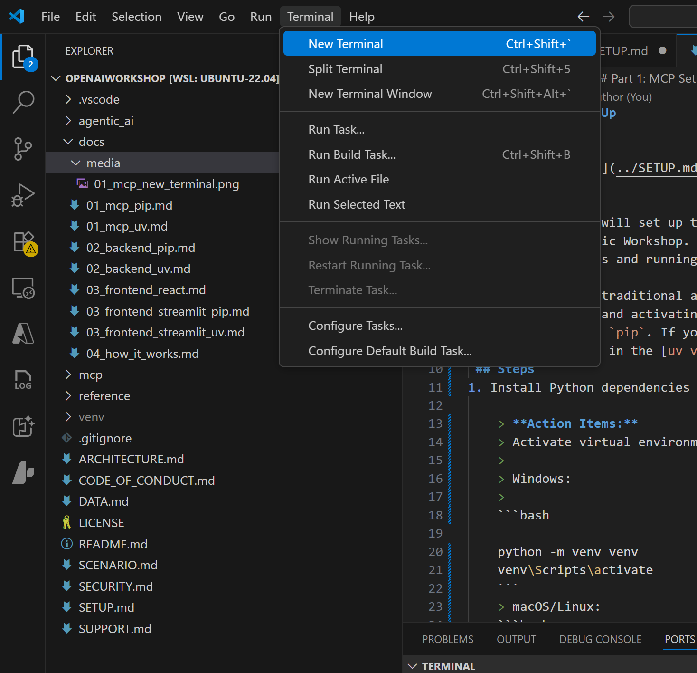

# Part 0: Microsoft AI Agentic Workshop Setup
> Note: Read the Workshop scenario overview [here](SCENARIO.md) before starting the setup.

## Goal
- Clone the repository
- Deploy a Large Language Model (LLM) using Azure AI Foundry
- Configure the applications to use your deployed model and other Azure resources

## Prerequisites for Part 0
- An Azure Account and Subscription
- An understanding of:
    - Azure Subscriptions and Resources
    - Github Mechanics (creating an account, cloning a repo, etc.)

## Steps
[1. Clone the Repository](#1-clone-the-repository)  
[2. Deploy LLM model using Azure AI Foundry](#2-deploy-llm-model-using-azure-ai-foundry)  
[3. Set up your environment variables](#3-set-up-your-environment-variables)

  
### 1. Open Terminal and Clone the Repository

> Open a new terminal window in VS Code or your preferred terminal application:
> 

In the terminal, run the following command to clone the repository:

```bash 
git clone https://github.com/microsoft/OpenAIWorkshop.git 
```

### 2. Deploy LLM model using Azure AI Foundry

1. Login to ai.azure.com. Create account if you don't already have access to an account.
2. Create project, use new hub is none exists. This will setup a hub, project container, AI services, Storage account and Key Vault
3. Copy API Key, Azure OpenAI Service endpoint and Project connection string to add to .env file (next step)
4. On project page, go to Models + endpoints -> Deploy model -> Deploy base model -> gpt-4.1
5. Select deployment type (Standard, Global Standard etc.) and region if desired
6. Customize deployment details to reduce tokens per minute to 10k or desired amount
  
### 3. Set up your environment variables 
  
Inside of the `agentic_ai/applications` folder, rename `.env.min` to `.env` and fill in all required fields as shows in the file. Here is a sample configuration:  
  
```bash  
AZURE_OPENAI_ENDPOINT="https://YOUR-OPENAI-SERVICE-ENDPOINT.openai.azure.com"  # Replace with your model-deployment endpoint in Azure AI Foundry
AZURE_OPENAI_API_KEY="YOUR-OPENAI-API-KEY"  # Replace with your Foundry project’s API key
AZURE_OPENAI_CHAT_DEPLOYMENT="gpt-4.1"  # Replace with your model deployment name
AZURE_OPENAI_API_VERSION="2025-01-01-preview" # Keep as is unless you have a specific need to change

BACKEND_URL="http://localhost:7000"
MCP_SERVER_URI="http://localhost:8000/mcp"
```  

From the root folder, navigate to the `mcp` folder, rename `.env.min` to `.env`, and fill in all required fields. Here is a sample configuration:  
  
```bash
AZURE_OPENAI_ENDPOINT="YOUR-OPENAI-SERVICE-ENDPOINT.openai.azure.com" # Replace with your model-deployment endpoint in Azure AI Foundry
AZURE_OPENAI_API_KEY="YOUR-OPENAI-API-KEY"  # Replace with your Foundry project’s API key
AZURE_OPENAI_API_VERSION=2025-03-01-preview # Keep as is unless you have a specific need to change
AZURE_OPENAI_EMBEDDING_DEPLOYMENT="text-embedding-ada-002" # Replace with your model deployment name for the embedding model
MCP_SERVER_URI="http://localhost:8000/mcp"
```

**Make sure your Azure resources are configured to use the correct model deployment names, endpoints, and API versions.**

---

## Next Step: Running MCP Server

Once your `.env` files are configured, you can start the MCP server. 
- Click here for [MCP setup instructions using uv](docs/01_mcp_uv.md).
- Click here for [MCP setup instructions using traditional method](docs/01_mcp_pip.md).
